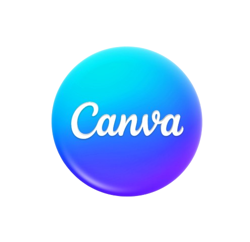

  

<!-- Short Intro & Contact -->

  <h3> I am a 🎓 Computer Science Undergraduate | 💻 Full-Stack Developer | 🎨 UI Designer</h3>
  
Passionate about crafting beautiful, functional digital experiences with clean code and thoughtful design

  
  

    
    
  

🚀 Tech Stack

### **Frontend**

  
  
  
  
  
  

### **Backend**

  
  
  

### **Database**

  
  
  

### **Languages**

  
  
  

### **Design**

  
  

## 🌟 **Featured Projects**

  

    <h3>🛒 E-Commerce App</h3>
    
Full-featured web app with product browsing, cart, user auth, and admin panel.

    
<strong>Tech:</strong> React, Node.js, MongoDB, Cloudinary

    
  

  

    <h3>📚 LMS Frontend</h3>
    
Responsive Learning Management System with course browsing & dashboards.

    
<strong>Tech:</strong> React, TypeScript, Tailwind CSS

    
  

  

    <h3>🎬 Movie Recommendation</h3>
    
Mobile app for discovering movies built with React Native.

    
<strong>Tech:</strong> React Native, Appwrite

    
  

## 🛤️ My Journey
- 🎨 UI Designer  
- 💻 Frontend Developer  
- 🌐 Fullstack Developer  
- 📱 Responsive Web Designer  
- 🖼️ Graphic Designer (Canva)

---

© 2025 Serini Puwakgolla | Built with ❤️ and React

